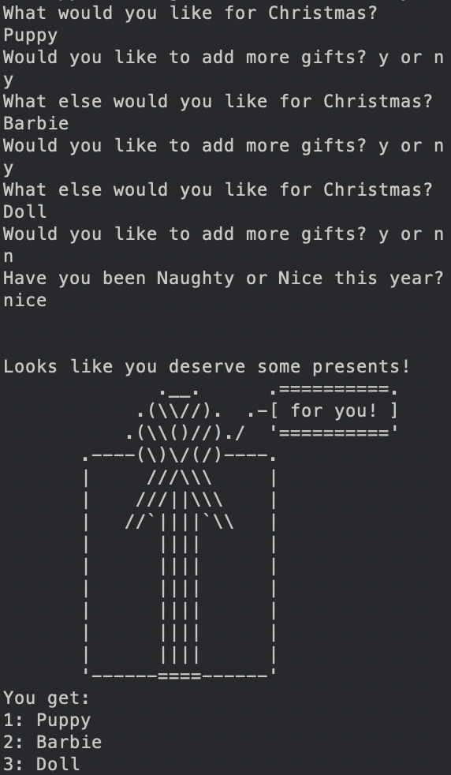
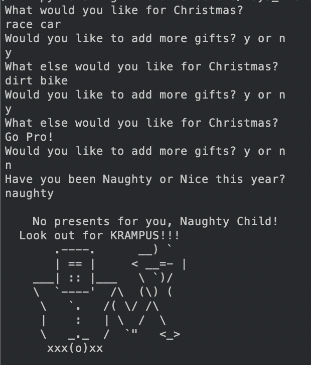
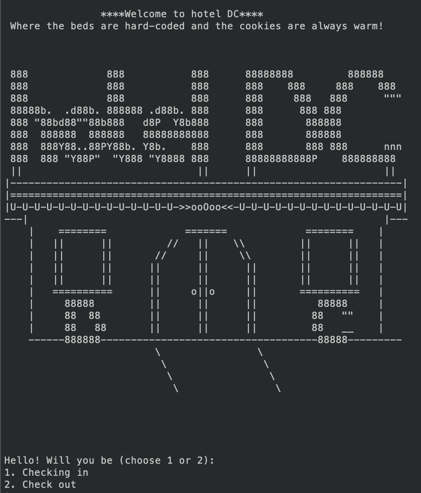
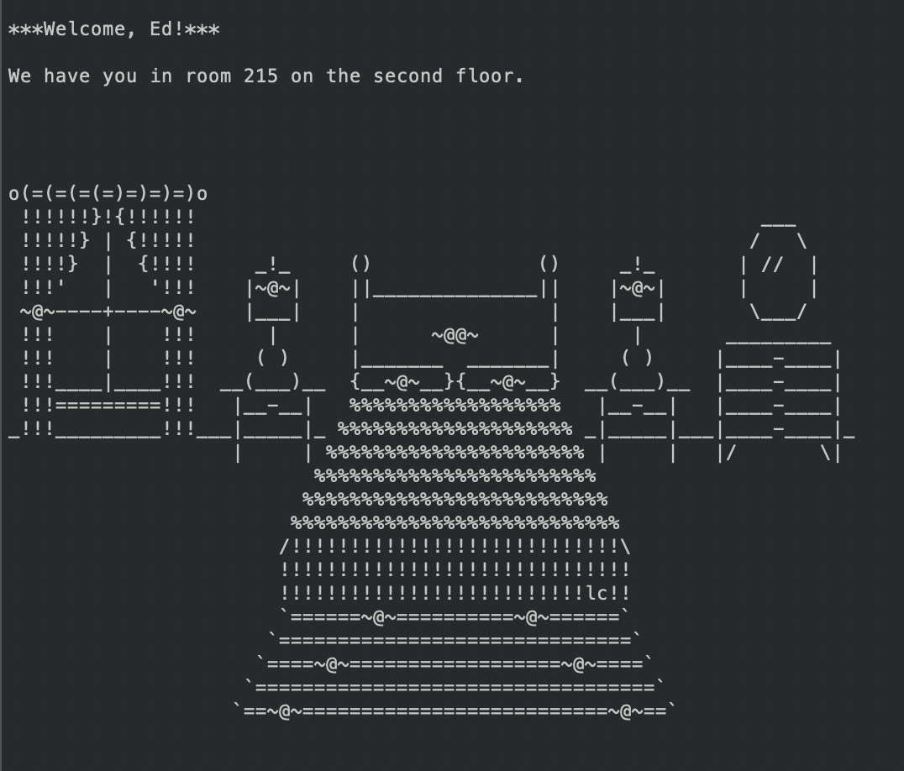
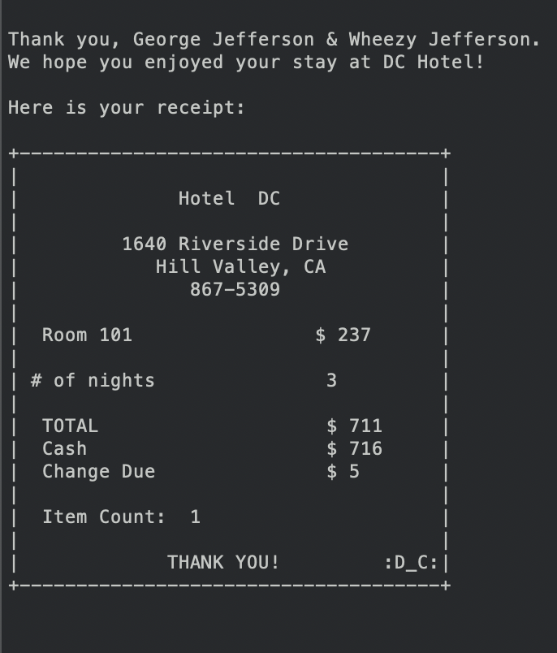

# Day 5 Exercises

There are two exercise files and one artwork file.

## Language:

Python

## Goals:

- practice Python syntax
- practice using functions
- practice creating and using lists
- practice referencing dictionaries
- practice removing and adding information to data
- practice error checking for user input
- practice using ascii art:)
- practice importing into a file
- use immutable data

# Christmas List! (Small/Med Exercise)

- Create a list for the user by asking them what they want for Christmas.
- Find out if they have been naughty or nice.
- Based on naughty/nice response, give user gifts or send KRAMPUS!
- Simple project based learning

# Welcome to Hotel DC! (Large Exercise)

- Begin with a dictionary of hotel guests.
- Ask user if they are checking in or out.
- Based upon response, assign a room or check out a user.
- Do not use any room more than once.
- Input number of guests and their names.
- Limit guests to six per room.
- Loop the program so that it goes back to home menu.

## Challenges/Solutions Large Exercise (Hotel):

- because the data was written with the floor before the room number, it was a challenge to check if the room number was taken
  - I used for loops within a while loop. If the number was taken, I reset the room number and then ran the new number through the for loops again to be sure that it was also not taken.
  - Because not all of the floors are in the original dictionary, I also had to create a way to break the loop if the floor was not present. It looks repetitive within the code and there may be a better way to handle this, but I was happy with the result. Works!
  - This also made it complicated when removing dictionary entries, but I will address that below.
- the original data was not to be altered
  - I haven't had much experience dealing with presented, unchangeable data, verses data that I create or collect. Therefore, the data was presented in a way that seemed less than ideal to the way I intuitively like to structure the functions and loops.
  - Not all of the floors had rooms assigned.
    - Because of this, I could not know if that key was already present in the dictionary. This created issues when planning how to add and how to remove entries.
    - If there was a room already in the floor, adding a new room created a second entry for that floor key. This made it tricky when removing the room as guests checked out. I ended up restructuring my function to delete the room as soon as it was discovered, but leave the floor key.
- printing the guest names from the key
  - I wanted the guest names to print in an expected way, so I joined them with .join and " & ". This seemed like the most logical way since I do not know how many guests are in each room, they can have up to six.
  - I would like to revisit this and create some loops to separate the guest names with ", " and then an ", & " between the last two names.
- printing the room number and totals within the ascii art
  - I wanted the receipt to change with each iteration and I wanted the receipt to also be personalized to the room that was being exited.
  - I was able to accomplish this by passing the room number into the function as an argument, using random numbers to give the total owed and the cash paid, and then using those two numbers to find the change.
    - I kept the random numbers for the total in intervals of the nightly rate and limited it to 10 nights total (237, 2370, 237) <- these are the random parameters.
    - I only allowed the cash paid to be 1-9 more than the total. This made it to where the artwork would have the correct spacing.
    - Something I could improve, if the total was more than 3 digits, the artwork was not aligned. I corrected this by using an if statement and two separate artworks, depending on the totals.
- room numbers must correlate with the floor
  - The beginning of the room number should be the same as the floor the room is on. To simplify this and not have several iterations, I found the floor assigned (random number 1-10), then found the room on the floor (random number 10-50), then turned those numbers into strings and concatenated them together.
  - A problem with this was that the rooms had to start at 10. Otherwise, the tens place was lost and the number ended up being a two digit number. I believe I have found a way to keep the place value determined, but I do not have plans to fix this at this time.

## Things to add!

- If this was a real game, it would be fun to allow the user to determine the floors and rooms per floor. I think that this would be an easy add on.
- I think that the print the list question should be hidden instead of the way I currently have it. It could be choice 3 on the home screen, but choice three is not shown. And then it could require a password. Or it could be left where it is and require a password. Something more than it has now.
- Right now, the dictionary is printing out (for employees only!) as a dictionary. I would prefer it read more easily. I plan to work on this next as it will be good extra practice with the dictionary itself.

# Favorite shots!

## Christmas List:

  
Results of Christmas List if you were nice.

  
Results of Christmas List if you were naughty! Look out for KRAMPUS!

## Welcome to Hotel DC!

  
This is the home menu and the opening ascii art.

  
This is the confirmation screen once your room has been assigned to you.

  
This is the receipt that prints once check out has been confirmed. The room number is based upon player input and the nights stayed, total, cash, and change, will be different each time the function is called.
